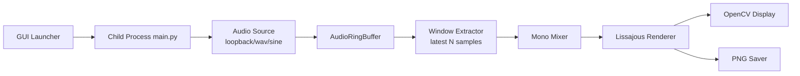

# Architecture

## Component view

## Failure modes and handling

- Loopback init fail -> fallback chain (`wav` if provided, else `sine`), if enabled.
- Buffer underrun -> zero-padding + warning.
- Invalid CLI values -> argparse validation + explicit error.
- GUI child process stuck on stop -> terminate, then kill fallback.

## Test mapping

- Renderer math and modes -> `tests/test_liss_render.py`
- CLI argument contract -> `tests/test_main_cli.py`
- Buffer reliability -> `tests/test_audio_capture.py`
- GUI state/command/process -> `tests/test_gui_*.py`
- Runtime smoke -> `tests/test_smoke_runtime.py`
